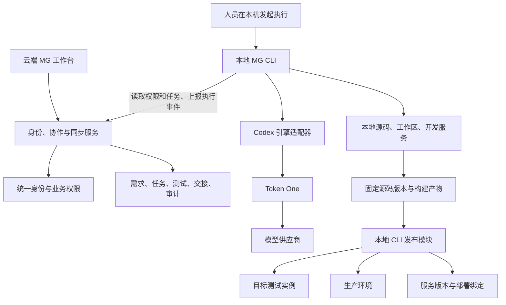

# MG Harness 本地开发与团队交付方案

日期：2026-09-09。状态：方案草案，尚未实施。

## 1. 产品定位与已确认约束

建设一个接入 MG 平台的智能研发工作台：人员通过云端统一身份登录，在本机执行 AI 开发和测试，经云端工作流交接需求、代码和验收结果，最终将经过验证的产物发布到生产平台。

用户已明确要求：

- 基于现有平台建设本地 Harness，调用 Token One 提供的智能 API。
- 在本地环境执行开发任务，打通生产交付。
- 本地测试复用云端用户与权限。
- 业务任务能在产品、开发、测试等人员之间流转。
- 应用页面部署在云端，人员下载安装本地 CLI；全部研发执行由本地 CLI 处理，云端展示本地上报的执行情况。

本方案据此采用“本地 CLI 执行、云端同步展示与协作、人员接力”的结构。云端维护身份、权限和业务流转，不运行 Agent、调度执行作业或托管构建发布流水线。发布人员作为建议增加的角色，允许同一人在不同项目中兼任角色。

首版假设：优先支持当前 Windows 开发环境，服务于内部可信项目；既有业务应用继续独立部署。具体 Git 托管平台、试点项目和测试资源尚未确定，不在此假定已存在。

## 2. 当前基础与真实缺口

以下结论来自本次本地文档和部分源码检查；不代表本次完成了生产连通性或模型调用验证。

| 基础 | 已观察到的能力 | Harness 仍需补充 |
| --- | --- | --- |
| mg-desktop-one / mg-platform | 桌面入口、公共 Vue UI、会话与应用通信 | 开发工作台页面、本地设备连接与任务操作 |
| mg-auth-one-identity | 统一用户、应用授权、身份协议 | 本地客户端接入方案、任务角色与环境权限的具体映射 |
| mg-token-one | 原生 Chat Completions、Responses、Messages；模型能力及路由可用性字段 | 引擎兼容认证、任务用量关联、凭据供应策略 |
| 服务管理 | 不可变版本、契约、环境绑定、摘要、修订和审计 | 自动构建部署、发布作业、运行健康验证 |
| deploy 脚本 | 既有应用的打包、部署、核验与回退流程 | 可重试的作业接口、结构化结果、项目发布配置 |
| mg-platform-kernel | Java 平台内核迁移工程 | 当前文档明确尚未完整验收和生产切换 |
| 当前桌面目录 | 有可用源码和发布资料 | 本次 git rev-parse 确认目录尚非 Git 仓库；任务 worktree 和提交追踪不能直接假定可用 |

特别注意：Token One 当前登记到平台的 token-one.api 1.2.0 仅包含账户及公开模型目录。原生推理接口存在于网关，但不能因此认为统一服务出口已经登记了模型推理能力。

## 3. 推荐结构



云端保存组织协作事实：谁提出需求、谁负责、交给谁、验收了哪个版本、发布了哪个产物。本地保存工作区、运行进程、缓存与尚未提交的工作；需要交接的内容必须形成可取得的版本或附件。

本地 CLI 使用主动出站连接同步云端，不要求把开发电脑端口开放到公网。首版工作台作为现有 MG 桌面的独立应用；本机安装 CLI，通过一次性配对建立用户、设备、项目的关联。CLI 是本地执行入口，可附带后台事件同步进程，不开放可被网页直接调用的命令执行服务。

本地执行指代码、Shell 和开发服务在本机运行。经 Token One 请求云端模型时，选入上下文的代码和工具结果仍会发送到模型链路；源码是否同步给团队平台是另一项独立配置。

### 3.1 云端应用与本地安装包的分工

推荐将所有日常业务页面部署在云端，接入现有 MG 桌面。人员用浏览器登录；需要执行任务的设备安装 MG CLI，安装包提供命令行入口、必要运行时、引擎管理及事件同步。前文使用的 Runner 概念统一落实为 CLI 内部执行模块，不再作为云端可调度的远程工作节点。

| 位置 | 承担的能力 |
| --- | --- |
| 云端工作台 | 需求、会话展示、任务认领、角色流转、测试结论、发布面板 |
| 云端业务服务 | 用户与项目授权、设备登记、事件接收、交付记录、审计 |
| 本地 MG CLI | 启动/停止任务、源码检出、Agent 循环、文件与终端操作、开发服务、构建、测试、发布、事件上报 |
| Token One | 云端模型调用、路由、模型权限和计量 |
| 目标测试/生产平台 | 运行已部署的业务应用，接收本地 CLI 发起的合法部署与核验请求；不托管研发 Agent |

产品人员及只使用已部署测试应用的测试人员可以仅使用浏览器；需要执行开发、自动测试或发布的人员安装 CLI。设备是否在线、事件是否同步与用户是否登录分别展示。

### 3.2 首次使用与任务执行

1. 用户登录云端 MG 工作台，下载安装本地 CLI。
2. CLI 完成登录/配对，本地选择工作目录，并读取云端授权的项目与本人任务。
3. 人员在本机通过 CLI 选择任务并启动。CLI 校验授权、任务归属和本地执行范围，生成 runId 并持久化本地运行记录。
4. CLI 托管 Agent 引擎，调用 Token One，在本地完成读写文件、执行命令、测试及构建。
5. CLI 通过认证 HTTPS 批量上报事件，云端向网页推送新记录。云端仅呈现收到的实际状态，显示最后同步时间；不根据沉默推断成功。
6. 人员通过 CLI 或工作台提交固定版本的交付包，云端处理业务交接。接收人在自己的 CLI 读取任务及交付版本，再启动下一次执行；交接不迁移原进程。

本地 CLI 与 Codex 子进程优先采用 stdio；CLI 到云端是事件同步协议。首版云端没有“远程执行命令”或“停止本地进程”接口；任务转交、取消等业务变更由 CLI 在授权检查时读取，并在本地实施相应策略，不宣称网页改状态就立即终止了本地进程。

本地事件包含 runId、deviceId、递增 seq、事件时间、类型和必要结果引用；云端用 (runId, seq) 去重、确认已落库的连续序号。CLI 保留持久化待发送队列，断线后补传；stdout/stderr 分块并限制大小，敏感内容在发送前处理。Agent 原始会话保存在本地，云端保存所需的展示投影和交付证据。

执行状态由本地实际结果产生；需求、负责人、验收和发布授权等业务状态由云端权限与工作流判定。上传“测试成功”事件不能直接替代有权限人员的验收动作。

### 3.3 本地运行环境如何交付与更新

采用“两层安装”：基础包包含 CLI 及其必需运行时；项目环境按配置补齐 Git、Node、Java、Python 或容器依赖。记录所需版本、检查命令、端口和数据源，按项目缓存。不能假定一个安装包能不加配置运行所有业务项目。

首次运行先检测已有工具，复用兼容版本；缺失工具按固定版本和可验证来源安装到应用管理目录，涉及系统服务或管理员权限时显式提示。基础包和更新清单验证签名/摘要；引擎与业务协议有版本兼容检查。运行中的任务固定版本，升级等待任务完成或进入可恢复状态，失败保留可回退版本。

本地原生执行作为首版路径；需 Linux 或独立数据库的项目采用本机容器/WSL 等项目环境，并检测其安装与启动条件。基础包不预装生产凭据或真实业务数据。

### 3.4 浏览器关闭、电脑离线和本地预览

关闭浏览器不影响本地 CLI 进程。同步链路中断时，CLI 在已有授权有效范围内继续本地执行并缓存事件；需要在线授权的下一步等待重连。Token One 链路不可用时，新的模型请求也需要等待或失败处理。电脑休眠、关机后本地任务无法持续执行；云端显示最后已知状态和同步时间，恢复后依据 CLI 实际结果补齐记录，不自动接管执行。

开发页面默认在当前电脑的新标签页打开已登记的本地预览地址。其他人员无法通过该 localhost 地址访问开发者电脑；跨人员体验应部署共享测试实例。受控预览隧道可以作为后续能力，需额外绑定身份、具体服务端口和有效期，不作为首版默认依赖。

云端同步任务事件和必要交付材料，不自动上传整个本地磁盘；源码通过项目 Git 权限共享。只读历史、待交接任务和发布记录持续保存在云端，设备更换不会丢失已提交的业务记录。

### 3.5 没有公网 IP 的连接方案

本地电脑无需公网 IP。CLI 主动经 HTTPS 443 请求云端登录、权限和事件接收接口；网页从云端读取或订阅事件。家庭路由器、办公 NAT 和运营商共享地址不影响这类正常出站访问，无需端口映射、动态域名或内网穿透。

首版采用短周期批量事件上报，减少长期连接依赖；需要时再增加由 CLI 主动建立的 WSS 连接。云端对网页的实时推送和 CLI 的事件上报独立，展示实时性取决于上报间隔和网络情况。

真正前置条件是本机能够访问云端域名与 Token One HTTPS 入口。企业网络若限制出站访问，需要使用获准代理或放行对应域名；这与有没有公网 IP 无关。

本地 CLI 主动连接部署目标也不需要本机公网 IP，但目标必须能通过已授权的网络路径访问；目标仅在内网时使用既有 VPN/专网。CLI 执行的是构建和部署编排，目标服务器正常运行部署后的业务程序。

执行日志、diff、截图或测试报告可以随事件/附件上传供同事查看。同事直接访问开发者电脑上的实时网站则需要受控预览隧道、VPN 或已部署的共享测试实例；不为状态展示提前引入该依赖。

## 4. 云端身份如何用于本地测试

### 4.1 身份与授权统一

人员沿用云端 userId、组织、应用授权和项目成员关系。本地不复制用户库，不维护另一套能够自行扩权的角色配置。

建议授权维度：用户 + 应用 + 项目 + 环境 + 操作。最终能力由云端授权交集决定：

`可执行操作 = 应用访问权 ∩ 项目角色权 ∩ 环境操作权 ∩ 本次任务授权范围`

例如，同一开发人员可以在项目 A 的本地测试环境调试，查看项目 A 的测试报告，但没有项目 B 的源码权限，也未必有项目 A 的生产发布权限。“复用云端权限”不意味着测试环境自动获得生产管理员权限。

| 凭据类型 | 作用 | 边界 |
| --- | --- | --- |
| 人员登录会话 | 使用工作台、业务应用、提交任务动作 | 通过云端校验真实用户及业务权限 |
| CLI 设备凭据 | 设备认证、心跳、事件同步 | 不能单独代表所有人员执行任意任务 |
| 任务委托凭据 | 指定用户在指定项目、工作区及期限内执行任务 | 可撤销；角色变化、注销、超时后重新验证 |
| Token One 推理凭据 | 模型调用、模型授权和额度 | 不将桌面登录 Cookie 当成模型 API key |
| 本地发布模块凭据 | 操作已登记的目标环境 | 和编码进程隔离，仅用于有权限人员发起的本地发布 |

具体登录流程优先复用身份中心支持的标准授权机制。原生客户端可采用系统浏览器与一次性回调；是否已有 PKCE、设备授权、令牌交换能力需要专门核验，缺失项作为接入开发工作，不假定身份中心已经支持。

### 4.2 本地测试业务接入

本地业务实例配置云端 issuer，后端按该业务的 audience 验证或内省用户身份，同时执行原有业务权限检查。可复用既有统一认证客户端，不把身份中心的管理凭据发给浏览器。

新增本地客户端及回调采用精确登记；不能为方便调试放开任意回调或任意跨域来源。设备配对和应用登录各自校验，不能仅凭“浏览器已登录桌面”允许本地命令执行。

数据策略默认：云端统一身份 + 本地/测试业务数据。需要共享业务数据时，显式连接项目的云端测试实例。生产业务数据访问遵循实际云端授权和环境配置，不通过复制生产数据库来实现单点登录。

权限撤销：在认领、启动、提交结果、交接、验收和发布前重新授权；长任务定期续约。离线时可查看已有本地内容、手工保存草稿；需要云端授权的新作业、交接、验收和发布暂停，恢复连接后重校验。撤销权限不能追回已下载源码，因此敏感项目还需控制工作区与数据下发范围。

本机用户可以修改自己控制的测试程序，因此上报结果只能证明收到了一项执行声明，不能单独作为云端放权的依据。测试人员在自己的本地 CLI 对固定源码/产物复验，云端保存执行身份、版本、证据及人员验收记录。首版采用内部可信人员协作，不宣称事件签名或摘要能证明本机未经篡改。

## 5. 团队流转：围绕交付物，而非共享聊天窗口

建议首版流程：

`需求草稿 → 待评审 → 待开发 → 开发中 → 待测试 → 测试中 → 待产品验收 → 待发布 → 发布中 → 已上线`

测试不通过回到开发中；产品不接受回到开发或需求澄清；发布失败进入发布异常，保留失败记录和原线上版本。阻塞、取消是独立状态，不能通过改负责人掩盖失败。

| 角色 | 主要工作 | 必须提交的交付物 |
| --- | --- | --- |
| 产品人员 | 创建需求、补充规则、明确验收条件、验收结果 | 需求版本、场景、验收标准、原型或附件 |
| 开发人员 | 认领、调用 AI 实现、运行本地检查、提测 | 提交/变更集、变更摘要、自测结果、启动与迁移说明 |
| 测试人员 | 接收固定版本、执行用例、登记缺陷、回归 | 用例及结果、复现步骤、证据、对应源码与产物版本 |
| 发布人员 | 检查交付包、选择环境、执行上线与回退 | 发布计划、目标版本、产物摘要、部署及健康结果 |
| 项目管理员 | 配置成员、工作流、资源和发布策略 | 授权及规则变更审计 |

工作流动作由后端验证。前端隐藏按钮只改善体验；开发人员直接请求“测试通过”也必须被拒绝，除非他在该项目明确拥有相应测试权限。

首版允许兼任角色；有需要的项目可配置“实现者不能自批发布”，不把同一人员兼岗一概判为非法。

### 5.1 一次交接包含什么

每次交接生成不可变 handoffId，关联：需求及验收标准版本、来源与目标负责人、repo/ref/commit、共享平台依赖版本、构建产物摘要、运行环境说明、检查记录、未解决问题和必要附件。

接收方先确认接单，再在自己的机器重建工作区，或进入已部署的共享测试环境。不能把 A 电脑的绝对目录当作 B 电脑可用的交付物；不能用持续变化的分支名作为唯一被测版本。

若没有 Git，首版原型可采用有摘要的只读源码归档进行交接；正式多人开发应先完成 Git 托管、历史基线和成员权限。聊天记录或 patch 可作辅助证据，不能替代完整可重建的源码基线。

需求更新形成新版本；代码或构建输入变化后，原测试与验收记录仍保留历史意义，但不能自动批准新产物。工作流以 expectedRevision 防止多人同时认领或旧页面覆盖。

### 5.2 AI 的角色

AI 可以整理需求、实现代码、生成测试、分析缺陷、整理交接和准备发布计划。工作台明确展示“AI 建议”“实际执行结果”“人员验收”三类记录，不把模型一句“测试已通过”当作测试结果。

各角色可以拥有自己的任务会话与上下文；交接传递的是交付包、摘要和授权材料。首版一个开发 Agent 即可，后续再按真实需求增加测试/评审 Agent，避免先构建复杂并行编排。

## 6. 引擎与 Token One 接入

优先采用 Codex app-server 作为首个本地引擎，外围自建任务、协作和交付管理。Codex 配置支持自定义 provider；当前官方文档的 wire_api 仅支持 responses，因此不能把任何 Chat Completions 模型直接视为 Codex 兼容模型。[配置参考](https://learn.chatgpt.com/docs/config-file/config-reference)

app-server 提供双向 JSON-RPC 和会话/执行事件。建议本地执行器托管子进程，通过 stdio 通信，固定引擎版本并生成对应协议类型。官方当前页面还对 app-server 命令及 WebSocket 生产使用标注了实验/不支持边界；本方案将其列为需验证和封装的引擎依赖，不让生产发布依赖该接口持续可用。[App Server 文档](https://learn.chatgpt.com/docs/app-server)

DeepSeek Harness 已开源并采用 MIT，官方仍标为开发者预览，支持插件化替换模型、工具、会话和 UI。可作为第二候选引擎，以相同真实任务比较兼容性、恢复能力和开发成本后再决定是否采用；不能仅凭插件化就假定更适合现有平台。[DeepSeek 官方介绍](https://www.deepseek.com/harness/)

模型供应商和 Agent 引擎是两个层次：Token One 负责模型路由与计量；引擎负责工具调用循环与上下文；MG 负责业务任务和交付。不能把“Claude 模型”和“Claude Code 引擎”当成同一种适配器。

### 6.1 首次接入验证

1. 由执行器取得授权模型目录，读取 supports_responses、supports_tools、available_protocols 等现有字段。
2. 从候选模型中选定首个 Coding 模型，完成真实 Responses 流式请求及多轮工具调用；目录字段仅代表声明及路由配置。
3. 运行一个最小开发任务，验证文件修改、命令退出状态、用量、取消和会话恢复。
4. 验证授权失效、额度不足、429、断流和上游错误；不能将半次执行当作成功，不能无条件重放已发生副作用的工具。
5. 锁定通过验收的引擎版本、模型 ID、协议与能力清单。

推理首版直接访问配置好的 Token One HTTPS 入口；若后续纳入统一服务出口，需新增推理契约并验证 SSE、取消、超时、鉴权和计量，不能复用仅供模型列表的现有登记。

任务级用量建议关联 taskId/runId/requestId；这些字段属于待新增关联契约。额度由 Token One 强制执行，工作台显示的金额估计与网关实际结算分开。

## 7. 本地工作区与恢复

- 项目绑定代码来源、允许操作目录、启动/检查命令、平台依赖和发布目标。
- 有 Git 的项目按任务创建独立 worktree；多仓库任务保存 repo→commit 清单，特别固定兄弟 mg-platform 依赖，避免交接后构建结果变化。
- worktree 解决代码目录并发，不提供进程或权限隔离；终端、文件权限、网络和数据库另行限制。
- 开发服务按任务分配端口、进程组和数据空间；停止任务只停止其拥有的进程，不停止机器上其他人的服务。
- 执行器单独保存自己的引擎配置与会话目录，不覆盖使用者已有 Codex 配置。
- 会话事件持久化，至少记录序号、runId、事件类型、时间和结果引用；UI 断线后从序号补读。
- 设备使用心跳、租约和递增执行代次。失联作业先标为状态未知，确认旧执行终止后才允许另一设备接管，避免双重修改。
- 崩溃恢复时重新读取实际工作区、进程和工具状态，带副作用的命令不能靠重播事件日志重新执行。
- 模型凭据存入系统凭据管理或公司既有机密系统；会话日志和交付包进行必要脱敏。

## 8. 从本地到生产的完整链路

交付动作分为提交源码、形成产物、部署程序、登记版本、切换环境出口。用户最终可在一个发布面板完成操作，系统内部仍保留这些独立步骤。

推荐流程：

1. 对确定的源码版本完成本地自测，形成可审查变更。
2. 本地 CLI 在与目标系统匹配的本机环境或容器中构建，固定锁文件、平台依赖和构建配置；不能直接将 Windows 原生依赖包当作 Linux 服务产物。
3. 生成不可变发布包，记录 artifactDigest、sourceRevision、测试证据及迁移说明。
4. 在真实测试环境部署同一产物，测试人员和产品人员验收。若环境未建设，先建设实例与隔离数据，不能用环境标签代替。
5. 本地 CLI 形成具体计划并同步发布面板：应用、环境、旧/新版本、影响范围、迁移、健康检查和回退方式。符合云端发布策略的人员完成批准，发布人员在自己的 CLI 发起执行。
6. 本地 CLI 发布模块使用已登记目标完成上传、部署和实际产物核验，再登记服务契约与部署实例。
7. 使用预期修订和部署摘要切换环境绑定，执行真实业务健康验证，回写任务、版本和审计记录。

发布编排全部运行在发布人员的本地 CLI，优先封装既有发布脚本。编码 Agent 不持有生产管理凭据；本地独立发布模块按云端授权使用当前人员的机密管理器或 SSH Agent。云端接收计划、授权请求和执行证据，不启动 CI 或发布进程。部署目标执行必要的服务启动、切换与迁移操作，业务程序继续运行在目标平台。

首版发布状态至少包括：准备中、构建中、待验收、待发布、部署中、验证中、成功、失败、回退中、已回退、需人工处理。使用 releaseId 和幂等键避免重复上线，按应用/环境控制并发。

回退优先恢复旧程序与旧出口绑定。数据库变更单独评估：涉及不兼容迁移、丢失数据或生产已有新写入时，不做盲目整库恢复。健康通过不代表业务验收通过，两类证据分别记录。

## 9. 应用与代码边界建议

建议新建独立 mg-harness-one 项目，采用现有 Vue/TypeScript 公共前端。本地执行器可采用 Node/TypeScript 以便管理现有工具链；云端协作服务按团队后端方向采用独立 Java 服务或平台边界模块。具体工程划分在接口评审时冻结。

```text
mg-harness-one/
  apps/web/                  需求、任务、工作区、测试、发布页面
  apps/local-runner/         配对、工作区、进程、引擎托管
  services/collaboration/    云端任务、流转、交付包、审计
  packages/contracts/       设备、任务、事件、交付和发布协议
  packages/engine-codex/    Codex 版本固定与协议适配
  packages/platform-client/ 身份、资源、服务登记适配
  deploy/                   受控发布作业模板
```

不将任务数据塞入桌面偏好，不在旧 Node 平台后端复制新的身份和服务治理实现。平台内核继续承担公共能力，研发工作台拥有需求、任务、测试和发布业务。

建议云端关系数据使用独立 PostgreSQL 数据库/明确隔离的存储边界，本地执行元数据使用 SQLite；源码通过 Git，较大测试附件与产物通过受控文件或制品存储。现有文件服务能否满足大产物、保留策略和权限，需要容量及接口核验。

## 10. 核心业务对象与接口草案

| 对象 | 关键字段或关系 |
| --- | --- |
| Project | 代码源、成员关系、工作流、环境、发布配置 |
| Requirement | 产品负责人、正文、验收条件、需求版本 |
| Task | requirementId、类型、负责人、状态、revision |
| Device / Workspace | 设备所属用户、授权项目、本地路径引用、源码基线 |
| Run | taskId、执行身份、deviceId、engineVersion、model、状态、租约代次 |
| Handoff | taskId、交接双方、需求版本、代码及产物引用、接收记录 |
| TestRun / Defect | 被测版本、测试环境、用例结果、证据、缺陷关联 |
| Artifact | 摘要、构建来源、平台依赖、存储位置、生成作业 |
| Release | 目标环境、产物、授权依据、部署结果、旧版本、回退状态 |
| AuditEvent | 操作者、委托主体、动作、对象、前后修订、时间、关联请求 |

API 名称仅作设计草案：

- `POST /projects/{id}/tasks`：创建项目任务。
- `POST /tasks/{id}/claim`：按 expectedRevision 认领。
- `POST /tasks/{id}/transitions`：执行合法业务状态转换。
- `POST /tasks/{id}/handoffs`：提交固定版本的交付包。
- `POST /handoffs/{id}/accept`：接收并记录交接结果。
- `POST /tasks/{id}/runs`：校验权限并登记 CLI 生成的 runId、项目及工作区引用；不创建云端执行作业。
- `POST /runs/{id}/events`：接收 CLI 顺序事件，按 runId/seq 去重并返回已确认序号。
- `GET /runs/{id}/events`：按事件序号恢复查看进度。
- `POST /releases`：接收本地 CLI 生成的具体发布计划。
- `POST /releases/{id}/authorize`：验证权限、修订、产物和策略，记录发布授权；不远程触发执行。
- `POST /releases/{id}/events`：接收本地发布结果并关联已授权计划。

本地执行事实由 CLI 上报；工作流状态由云端校验授权和修订后更新；发布结果关联具体授权及产物，明确标注证据来源。浏览器不能伪造执行事件，不提供任意前端可写的统一 status 接口。

## 11. 首版范围与实施顺序

首版闭环：一个项目、一台或两台 Windows 设备、一个通过验收的 Codex/Token One 组合、一条产品→开发→测试→验收→发布流程、一种现有生产部署方式。

| 阶段 | 交付内容 | 通过条件 |
| --- | --- | --- |
| 0：基础验证 | Git 基线、云端身份接入、Token One 工具循环、目标项目确定 | 同一云端用户在本地按真实权限运行最小任务 |
| 1：任务与本地执行 | 工作台入口、CLI 配对、任务读取、本地执行、事件同步、日志与 diff | 可产生可追踪的源码变更，断开 UI 不影响 CLI，事件断线可补传 |
| 2：跨人员交接 | 产品需求、提测、缺陷退回、验收、交付包 | 第二个人在另一台机器或测试实例验收同一版本 |
| 3：交付上线 | 本地 CLI 固定构建、测试部署、发布计划、生产发布及回退 | 同一已验收产物可由本地 CLI 部署，云端展示真实结果 |
| 4：团队扩展 | 多项目、多仓库、模型选择、评审 Agent、权限策略细化 | 已有闭环稳定后按试点数据决定优先级 |

排期粗估：熟悉现有平台的 1 名全栈开发、测试/运维配合，前四阶段约 5–8 周；若真实身份委托、Git 托管、共享测试环境或发布适配需要补建，应重新估算。该范围是可试点版本，不代表完整企业产品交付承诺。

首版不展开通用办公 preset、插件市场、复杂多 Agent 调度、多云部署和移动端控制。完整原生桌面包装及自动更新可在本地执行与协作闭环稳定后实施。

## 12. 首版验收标准

1. 产品 A 提交需求，开发 B 认领，测试 C 验收，发布人员 D 上线；操作、版本和结果均能从同一需求追溯。
2. 本地和云端显示同一用户标识；撤销云端项目权限后，新执行、交接和发布按规则被拒绝。
3. 没有测试权限的开发用户无法通过直接 API 请求提交“测试通过”。
4. 测试环境访问不自动授予生产写权限；数据源、环境和当前操作主体清晰可见。
5. B 的提交在 C 的机器/测试环境可重建，mg-platform 等共享依赖版本一致。
6. 更改已测代码或验收标准后，新版本不能复用旧批准自动上线。
7. Token One 返回真实工具调用并完成一次文件修改及检查；取消、断流、额度不足都有明确状态。
8. 多人抢领、重复提交、执行器失联和恢复不会产生双重执行或覆盖交接结果。
9. 本地构建、测试和生产使用匹配的产物摘要；CLI 重试发布不会重复迁移或重复切换。
10. 回退演练可以恢复旧程序/出口，并准确报告数据库是否兼容；不覆盖上线后的业务新写入。
11. 在没有公网 IP、没有入站端口映射的电脑上完成 CLI 执行和云端展示；断开同步后补传事件，不重复记录、不虚报成功。
12. 云端不运行 Agent、Shell、构建或发布进程；所有研发执行可追溯到具体人员的本地 CLI。

## 13. 实施前待确定的信息

本方案无需这些答案即可评审；真正开始实施时冻结以下配置：试点应用、Git 平台及仓库划分、是否已有共享测试实例、第一批人员与兼岗规则、目标操作系统范围、首个模型、部署目标及数据库迁移要求。

优先建议用一个低依赖的现有业务小功能验证全流程。第一项开发工作应是“云端用户登录 → 本地授权执行 → 固定版本交接”的纵向验证，而不是先制作完整聊天 UI。

## 14. 业务收益判断与试点决策

判断：值得试点。现有统一身份、Token One、桌面与服务治理能减少新产品所需的公共能力建设；实际收益取决于研发任务频率、交接等待、返工及发布成本，而非功能数量。

优先验证三个收益假设：

- 需求和验收条件随任务流转，减少开发与测试反复询问背景。
- 代码、环境及被测产物固定，减少“我这里能运行”和测错版本引起的返工。
- 自测、提测材料和发布检查自动收集，减少人员重复执行命令及整理证据。

适合：持续维护多个内部应用，存在重复改动、频繁提测和跨人员接力。收益较弱的情况：任务很少、需求长期无法明确、单人偶尔开发，或主要等待来自预算/业务决策；这些问题不能靠增加执行器解决。

产品交互应自动填充已有证据，只向人请求需要判断的信息。产品填写需求与验收条件，开发提交变更，测试提交结论，发布人员选择已验证版本；repo、commit、测试退出状态、日志和产物摘要尽量自动生成。避免手工重复登记多个系统。

建议先用 1–2 周做受限试点：一个项目、一个小团队、最小登录/执行/交接集成，发布先复用现有人工确认脚本。该试点不是第 11 节完整首版。可选 10–20 个规模相近的历史/新任务，记录复杂度和紧急程度，作为方向性观察，不宣称统计显著性。

| 指标 | 定义与观察方式 |
| --- | --- |
| 交付周期 | 从需求进入可开发状态到产品验收，另记到生产时间；对比中位数及每个任务 |
| 交接等待 | 已提交交付包到下一角色实际接收的时间 |
| 人员投入 | 产品、开发、测试、发布实际投入合计，包含纠错与补材料 |
| 首次提测通过 | 首次正式提测后无需代码返修即可通过的任务比例 |
| 发布质量 | 发布失败、回退及上线后观察期内缺陷；观察窗口保持一致 |
| 使用与维护负担 | 每任务人工补录时间、工具维护时间及绕开系统的原因 |
| 总成本 | 人员投入、模型实际账单、执行资源和系统维护成本 |

净收益估算采用“节省人员时间的业务价值 − 新增模型/资源费用 − 维护与流程成本”，同时要求质量没有明显下降。不要用生成代码行数、Agent 数量或模型调用量证明效率。

试点前和参与者约定可接受的改进幅度；试点后若等待/返工/人工投入明显改善，且质量与成本可接受，再投入完整首版。如果收益主要来自现有脚本自动化，就先保留这部分；如果瓶颈仍是需求决策，则优先改善需求与验收流程。

## 15. 核验依据

- [平台现状](../README.md)、[平台应用约定](platform-conventions.md)、[环境发布与部署绑定](service-environments.md)。
- 本地 `mg-platform/README.md`：公共前端、源码依赖与应用边界。
- 本地 `mg-platform-kernel/README.md` 及 `docs/migration-progress.md`：Java 迁移状态。
- 本地 `mg-token-one/README.md`、`docs/codex-gpt6-setup.md`：原生协议和已有 Codex 接入说明。
- 本地 `mg-token-one/mg-gateway/apps/gateway/src/modules/relay/relay.controller.ts`、`relay.service.ts`、`native-responses-transport.ts`：路由、能力目录、原生流式转发实现。
- 本地 `mg-token-one/mg-gateway/services/manifest.json`：当前登记服务仅覆盖模型目录。
- [OpenAI 配置参考](https://learn.chatgpt.com/docs/config-file/config-reference)、[App Server 文档](https://learn.chatgpt.com/docs/app-server)、[DeepSeek Harness 官方介绍](https://www.deepseek.com/harness/)：2026-09-09 查阅。
